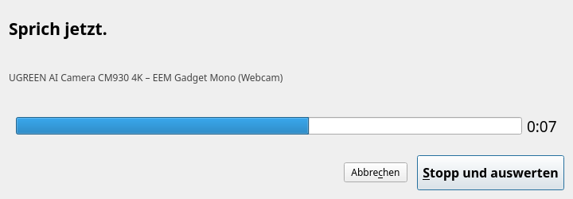
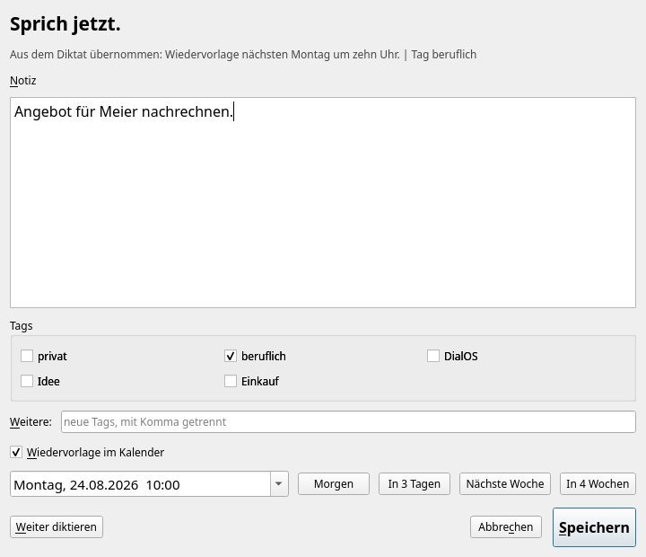
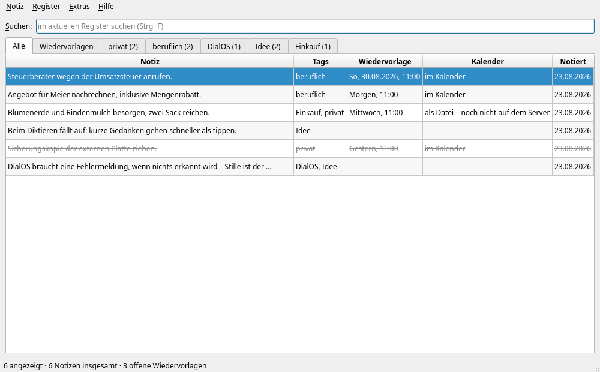
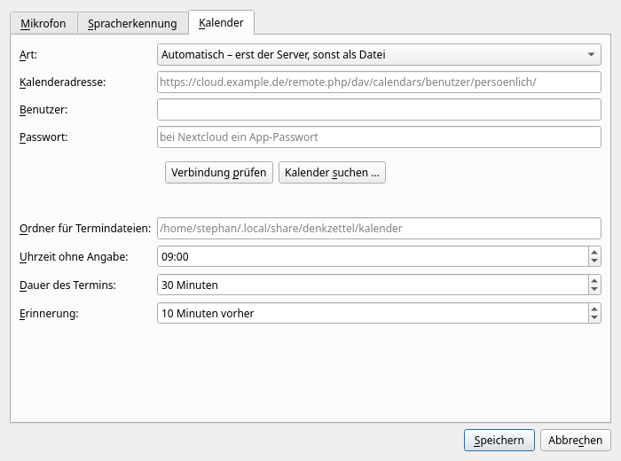
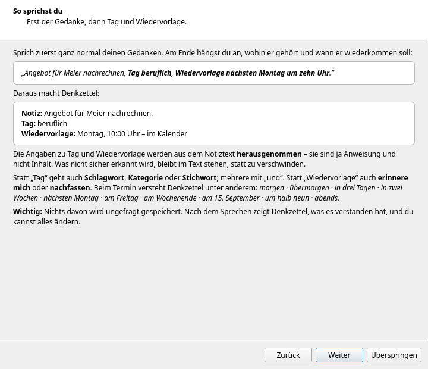
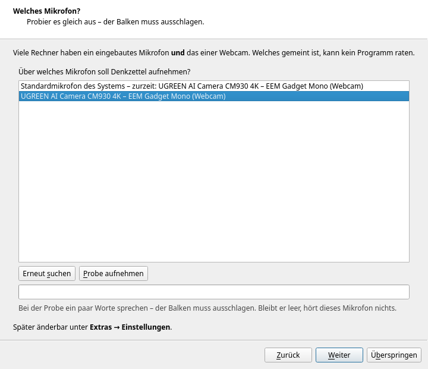
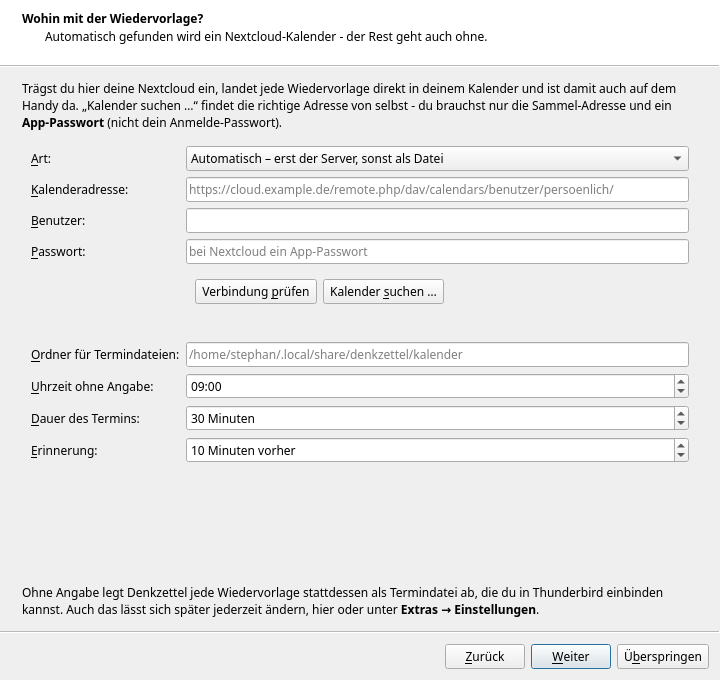
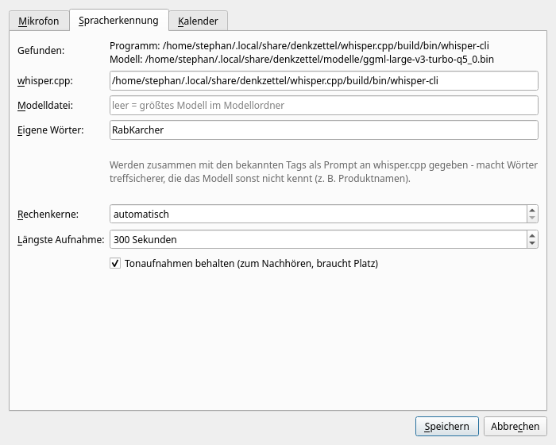

<picture>
  <source media="(prefers-color-scheme: dark)" srcset="assets/app-icon-dark.png">
  
</picture>

[Deutsch](README.md) | [English](README.en.md) | [Changelog](#changelog) | [TODO](TODO.en.md)

# Denkzettel

*Denkzettel* is German for a note you write yourself so you remember -
literally "thought slip". The name stays untranslated, like DialOS.

A voice notebook for Debian- and Arch-based systems: **speak** a thought,
file it under **tags** (private, work, DialOS …) and give it a
**follow-up date** that goes straight into your calendar.

Speech recognition runs **entirely on your own machine**. No audio leaves
the computer - neither for recognition nor for storage.

Built together with [Claude](https://claude.com). Part of the
[DialOS](https://dialos.org) family - hence the related icon: the same
lady, but instead of sound waves, a pencil writes along.

## How it feels

Press the shortcut. Speak (in German):



> „Angebot für Meier nachrechnen, Tag beruflich,
> Wiedervorlage nächsten Montag um zehn Uhr.“
> *(Recalculate the quote for Meier, tag work, follow up next Monday at ten.)*

Press space. Denkzettel shows:

| | |
|---|---|
| **Note** | Angebot für Meier nachrechnen. |
| **Tag** | beruflich ✓ |
| **Follow-up** | Monday, 24 Aug 2026, 10:00 |



Check it, press `Ctrl`+`S`. The appointment is in the calendar, the note
is in the "beruflich" tab.

Tag and follow-up instructions are lifted out of the spoken text and
**removed from the note** - they are instructions, not content. Anything
not recognised with confidence stays in the text rather than vanishing.

**Note on language:** the spoken-command parsing is German only. The
program is usable with any language whisper.cpp supports (see
`[erkennung] sprache` in the config file), but then tags and follow-up
dates have to be set in the window rather than dictated.

## What it understands

**Tags** after `Tag`, `Tags`, `Schlagwort`, `Kategorie`, `Stichwort` -
several joined by "und" or commas. A known tag is suggested even when it
merely appears in the sentence. `#DialOS` works too.

**Follow-up** after `Wiedervorlage`, `erinnere mich`, `Erinnerung`,
`nachfassen`, `Termin`:

| Spoken | Result |
|---|---|
| heute · morgen · übermorgen | today / tomorrow / day after |
| in drei Tagen · in 14 Tagen · in zwei Wochen · in einem Monat | relative to today |
| nächsten Montag · am Freitag · diesen Mittwoch | next matching weekday |
| nächste Woche · nächsten Monat · nächstes Jahr | + 1 week / month / year |
| am Wochenende | the coming Saturday |
| am 15. September · am dritten Oktober · 01.09.2026 | fixed date |
| um zehn Uhr · um 14:30 · um halb neun · viertel nach acht | time of day |
| morgens · mittags · nachmittags · abends · früh | 8 / 12 / 15 / 18 / 8 o'clock |

Without a time, the configured default applies (9:00 by default). Order
does not matter: "um zehn am Montag" works just as well.

## The notebook

One window with **tabs**, like a real notebook: "Alle" (all),
"Wiedervorlagen" (follow-ups) and one tab per tag.



**Everything works from the keyboard** - creating, renaming, deleting and
switching tabs, as well as creating, editing, ticking off and deleting
notes. Every command is also in the menu, so you can find it without
knowing it by heart. Press `F1` for the list.

| Key | Action |
|---|---|
| `Ctrl`+`N` | dictate a new note |
| `Ctrl`+`Shift`+`N` | type a note |
| `Enter` / `F2` | edit note |
| `Ctrl`+`D` | done / open again |
| `Del` | delete note |
| `Ctrl`+`F` | search |
| `Ctrl`+`T` | new tab (tag) |
| `Shift`+`F2` | rename tab |
| `Ctrl`+`Shift`+`W` | delete tab |
| `Ctrl`+`PgUp/PgDn`, `Alt`+`1…9` | switch tabs |

Deleting a tab keeps the notes - only the tag goes. Renaming carries the
tag everywhere; if the new name already exists, both are merged.

## Calendar

Two routes, switchable in the settings:

* **CalDAV** - the appointment goes straight into your Nextcloud calendar
  and is therefore on your phone as well. With Nextcloud, use an **app
  password**, not your login password.
* **iCalendar file (.ics)** - written to a folder you can add to
  Thunderbird as a local calendar. No server, no credentials.

The default is **automatic**: server first, file as a fallback. The note
then remembers that the appointment is not on the server yet; `Ctrl`+`R`
(or `denkzettel nachtragen`) submits it once the network is back. An
appointment must not get lost just because there was no connection.

You do not have to hunt for your calendar's address - "Kalender suchen …"
in the settings fetches the list from the server.



## First start: the introduction

The very first start runs a short wizard - five pages, one minute: what
the program does, **how to speak** (with an example and what it turns
into), **which microphone** to use, **which keys** there are, and what is
still open (the calendar).







It is not only an explanation but also the way to **change the
microphone**, so it can be brought up again at any time:

* in the notebook via **Hilfe → Einführung**
* in a terminal with `denkzettel einfuehrung`

## Microphone

Many machines have a built-in microphone **and** the one in a webcam. No
program can guess which one you mean, so the introduction asks and lists
every device it found - including a **test** where you say a few words
and watch the level meter to see whether the device hears anything at
all. To change it later, run the introduction again, use the settings
dialog, or:

```
denkzettel mikrofone --waehlen
```

Two things are handled deliberately here, because they fail silently
otherwise:

* While recording, a **level meter** shows the input. If it does not
  move, a warning appears in the window straight away - a dead microphone
  otherwise only becomes apparent once the thought is gone.
* If the configured device is **not connected** (webcam unplugged),
  Denkzettel records via the system default and **says so**, instead of
  producing an empty file.

## Custom vocabulary

whisper.cpp naturally does not know names, brands or technical terms -
"RabKarcher aufladen" (a device name) came out as "Rabkascha, Auflagen"
in one test. Under **Extras → Einstellungen → Spracherkennung** you can
enter a list of custom words; it is passed to whisper.cpp together with
the known tags as a prompt and makes such words noticeably more
accurate. Costs no time, just a few entered words.



## Installation

```
git clone https://github.com/Stephan-Lefty/Denkzettel.git
cd Denkzettel
./install.sh
```

The script detects Debian- and Arch-based systems, installs the packages,
builds whisper.cpp, downloads the model (`large-v3-turbo` by default,
about 574 MB), creates the menu entries, asks about the microphone and
sets up the `Meta`+`N` shortcut.

Smaller model for weaker machines:

```
./install.sh --modell medium     # 539 MB
./install.sh --modell small      # 190 MB
```

Check the setup:

```
denkzettel pruefen
```

### Commands

| Command | Action |
|---|---|
| `denkzettel` | open the notebook |
| `denkzettel erfassen` | record right away (the shortcut) |
| `denkzettel einfuehrung` | show the introduction again |
| `denkzettel mikrofone --waehlen` | choose the microphone |
| `denkzettel kalender` | list calendars on the server |
| `denkzettel nachtragen` | submit pending appointments |
| `denkzettel pruefen` | check the setup |
| `denkzettel einstellungen` | open the settings |

## Where things live

| What | Where |
|---|---|
| Settings | `~/.config/denkzettel/config.ini` |
| Notes (SQLite) | `~/.local/share/denkzettel/notizen.db` |
| Recordings | `~/.local/share/denkzettel/aufnahmen/` |
| Calendar files | `~/.local/share/denkzettel/kalender/` |
| Speech recognition | `~/.local/share/denkzettel/whisper.cpp/`, `…/modelle/` |

The notes live in **one** file - copying it is a complete backup.

## Why whisper.cpp and not Vosk

DialOS recognises speech with Vosk, and for good reason: there it is a
fixed list of command sentences, and with a restricted grammar Vosk is
very reliable at that.

Here it is the opposite - freely spoken thoughts, no fixed vocabulary.
That is exactly where Vosk is noticeably weaker, and correcting the
result afterwards costs more time than the larger model costs in compute.
Both run offline, so the principle is unchanged.

## License

MIT, see [LICENSE](LICENSE).

This does not cover the parts Denkzettel merely uses rather than ships:
[whisper.cpp](https://github.com/ggml-org/whisper.cpp) (also MIT) and the
speech recognition models downloaded by `install.sh`.

**The name and visual identity are excluded as well**: "Denkzettel" and
the icons in [assets/](assets/). They are derived from the app icon of
[DialOS](https://github.com/Stephan-Lefty/DialOS) - the same lady, the
same circle, only a pencil writes along instead of the sound waves. The
same reservation applies to DialOS and is carried over here: anyone may
take the code, rebuild it and pass it on; still calling the result
"Denkzettel", or shipping it with this face, is not covered. Otherwise
someone else's work carries a mark that a different person stands behind.
Details in
[DialOS/docs/lizenzen.en.md](https://github.com/Stephan-Lefty/DialOS/blob/master/docs/lizenzen.en.md).

## Changelog

### 0.1.0 (2026-08-23)

First release.

* **The application menu now shows the filled circle instead of the
  transparent line drawing** (2026-08-24, Stephan's request). Same
  colour choice as in the READMEs: the dark circle on a light panel.
  `assets/icon-bauen.py` generates `menue-*.png` at every icon-theme
  size using the same colour as `app-icon-light.png`, and `install.sh`
  installs those instead of the transparent `icon-*.png` into the
  application menu. A menu always shows one fixed version, no automatic
  switching by system theme.
* **First real dictation over the webcam succeeded** (2026-08-24), after
  two fixes. The recording itself was never the problem - the level
  trace showed a clean speech pattern from the start. First, the
  webcam's input gain was at 76% instead of 100% out of the box. Second,
  a device name outside the vocabulary ("RabKarcher") turned into
  gibberish, while date and time in the same sentence were exactly
  right - a vocabulary problem, not an audio-quality one. This led to
  **custom vocabulary for whisper.cpp** (Extras → Einstellungen →
  Spracherkennung): names, brands and technical terms passed together
  with the known tags as a prompt. Verified on exactly this case:
  "Rabkascha" became "Rabkarcher".
* **Calendar setup moved into the introduction** (2026-08-24), for the
  same reason as the microphone: a new page "Wohin mit der
  Wiedervorlage?" embeds the same calendar view as the settings,
  including "Kalender suchen …". Microphone and calendar choices are now
  saved immediately rather than only at the end - skipping the
  introduction afterwards still keeps the choice made.
* **Introduction on first start** instead of a question in the install
  script (Stephan's call). Five pages: what the program does, how to
  speak, microphone selection with a live test, keyboard shortcuts, and
  what to do next. Available again at any time via *Hilfe → Einführung*
  or `denkzettel einfuehrung` - it is also the way to change the
  microphone. Rationale: a question that scrolls past once in a terminal
  is never seen again, and you answer it before you know the program.
* **One menu entry, under Utilities.** Initially there were two entries
  in two categories: `Categories=Office;TextEditor;` makes KDE file the
  program under both Office and Utilities, and the second .desktop file
  was only meant to carry the global shortcut. It is now
  `NoDisplay=true`; "record a thought" hangs off the single entry as an
  action.
* **Recognition verified against known text** (2026-08-23): four DialOS
  speech samples with a recorded transcript were run through
  whisper.cpp. All four correct in substance; deviations only in
  punctuation and capitalisation, with a single word error. About 27
  seconds per dictation - essentially the model load time, not the
  length of the recording.
* Recording via PulseAudio/PipeWire (`parecord`, falling back to
  `arecord`) with a level meter, a maximum duration and a warning when
  the microphone is silent.
* Microphone selection during installation and at any time via
  `denkzettel mikrofone --waehlen`. Devices that describe themselves
  uselessly are identified by the product name taken from the device id -
  "EEM Gadget Mono" becomes "UGREEN AI Camera CM930 4K".
* Speech recognition via whisper.cpp, fully offline. Detection is
  deliberately strict: on many systems `/usr/bin/whisper` is the entirely
  different **openai-whisper** with different arguments. Ambiguous names
  are verified before use, otherwise only the first dictation would fail.
* German parsing of the dictation: tags and follow-up dates are lifted
  out, the note text stays clean. Relative dates, fixed dates, times in
  words and digits, times of day - date and time in any order.
* Notebook with one tab per tag, fully keyboard-operable; tabs can be
  created, renamed (merging on collision) and deleted.
* Calendar via CalDAV with a fallback to iCalendar files and automatic
  resubmission once the server is reachable. Calendar discovery via
  PROPFIND.
* Its own icon, derived from the DialOS app icon: the original is
  converted back into a line drawing with transparency, the sound waves
  are removed, a written line and a pencil are added. The build script
  verifies that the pencil does not touch the ring and aborts otherwise.
